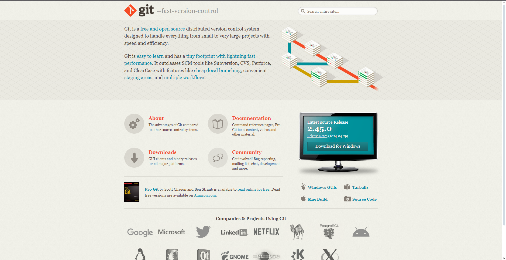
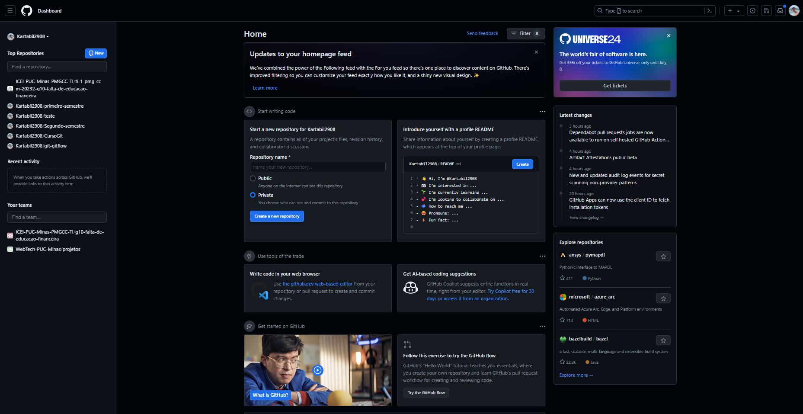

# 😄 Laboratório Git e GitFlow

## <mark style="color:yellow;">Em primeiro lugar, entenda alguns conceitos importantes:</mark>

### <mark style="color:orange;">O que é o Git?</mark> 🤔

## A ferramenta Git

O Git é um sistema de controle de versão distribuído amplamente usado na área de desenvolvimento de software. Ele permite que você rastreie e gerencie alterações em arquivos, crie ramificações para desenvolver recursos independentes e mescle essas mudanças de forma eficiente. É uma ferramenta fundamental para o desenvolvimento colaborativo, ajudando a manter o código organizado e permitindo o trabalho em equipe de maneira eficaz.

### <mark style="color:orange;">O que é GitFlow?</mark> 💭

Gitflow é um modelo de fluxo de trabalho que busca simplificar e organizar o versionamento de ramificações de um projeto de desenvolvimento no Git.

***

## <mark style="color:yellow;">Instalando a ferramenta:</mark> ⚙️

### <mark style="color:orange;">Vídeos explicativos:</mark> 🎥

colocar vídeo explicativos


### <mark style="color:orange;">Instalando a ferramenta no sistema Windows 10 e 11:</mark>

1\. Em primeiro lugar, você deve entrar no site do **Git** _(_[_https://git-scm.com_](https://git-scm.com)_) **e**_** você encontrará uma tela assim:**

<figure><figcaption><p>Site da ferramenta Git</p></figcaption></figure>

2. Clique na opção **Downloads** e escolha seu sistema operacional _(Nesse caso, será Windows)_:

<figure><figcaption><p>Aba de Downloads do Site Git</p></figcaption></figure>

<figure><figcaption><p>Escolhendo o tipo de Sistema (32-bits ou 64-bits)</p></figcaption></figure>

4. Após executar o arquivo de instalação, clique em _install_ e apenas prossiga as abas com a opção _next,_ pois o Git será instalado nos caminhos padrão da ferramenta.

<figure><figcaption><p>Instalador da Ferramenta Git</p></figcaption></figure>

Pronto! Você conseguiu instalar a ferramenta Git com sucesso na sua máquina com sistema operacional Windows! 😀

### <mark style="color:orange;">Configurando a ferramenta (Windows 10 e 11):</mark>

1. Abra o aplicativo **Git Bash** e digite o seguinte código _(sem o $):_

```
$ git config --global user.name "Nome_usuário"
```

Nesse código estamos configurando o nome de usuário da máquina, ou seja, coloque de preferência o seu nome ou o _nickname_ da sua conta do GitHub _(ela será criada em breve, mas já pense no nome)._

Obs: Se não retornar nada, ou seja, uma linha vazia, será um sinal que está tudo correto!

<figure><figcaption><p>Configurando o nome de usuário</p></figcaption></figure>

2. Agora, digite o código abaixo para configurar o **email** _(sem o $):_


```
$ git config --global user.email "email"
```

<figure><figcaption><p>Configurando o email</p></figcaption></figure>

3. Prontinho! Agora, para verificar se a configuração está correta, basta digitar o código abaixo _(sem o $):_

```
$ git config --list
```

<figure><figcaption></figcaption></figure>

A opção _user.name_ está com meu nome e a _user.email_ está com meu email! Assim, você concluiu a configuração inicial da ferramenta Git no sistema Windows! 😝

***

## <mark style="color:yellow;">GitHub:</mark>

### <mark style="color:orange;">O que é o GitHub?</mark>🧐

O GitHub é uma plataforma de hospedagem de código-fonte baseada na web, que utiliza o sistema de controle de versão Git. Ele permite que desenvolvedores colaborem em projetos, acompanhem mudanças feitas no código, gerenciem versões e trabalhem em equipe de forma eficiente. Ele é amplamente utilizado pela comunidade para gerenciar projetos, colaborar em código, e compartilhar conhecimento, tornando-se uma parte essencial do ecossistema moderno de desenvolvimento de software.

### <mark style="color:orange;">Criando a conta do GitHub:</mark> 😎

1. Acesse o site do **GitHub** _(_[_https://github.com_](https://github.com)_)_ e clique em _sign up:_

<figure><figcaption><p>Site do GitHub</p></figcaption></figure>

2. Coloque suas informações pessoais _(nome, email, senha, nickname)_ para criar a conta:

<figure><figcaption><p>Exemplo de criação de conta</p></figcaption></figure>

3. Após essa etapa, o GitHub pedirá uma **autenticação** que é, geralmente, enviada ao email escolhido.

### <mark style="color:orange;">Autenticações:</mark> 👮

Uma parte importante do trabalho é manter sua **conta segura**, então o GitHub fornece métodos de segurança para protegê-la:

#### <mark style="color:red;">Usuário e senha:</mark>

O método de "usuário e senha" consiste em, quando o colaborador do projeto for realizar alguma modificação ou entrar em sua conta, o sistema pedirá só o usuário e a senha. Esse é a maneira menos segura para verificar a autenticidade.

#### <mark style="color:red;">Tokens:</mark>

Tokens são senhas geradas pelo próprio GitHub, elas são métodos mais seguras que as senhas normais, pois são geradas aleatoriamente e com grande número de de caracteres. Além disso, você pode configurar os acessos dessa senha e o tempo de existência, semelhante à um cartão de acesso.

**Criando um Token pessoal:**

1. Vá em configurações, clicando na foto do seu perfil no canto superior direito da tela:

<figure><figcaption></figcaption></figure>

2. Agora vá em _Developer settings:_

<figure><figcaption></figcaption></figure>

3. Vá em _Personal access tokens / Token (classic):_

<figure><figcaption></figcaption></figure>

4. Selecione _generate new token (classic):_

<figure><figcaption></figcaption></figure>

5. Configure seu token e pronto!

<figure><figcaption></figcaption></figure>

#### <mark style="color:red;">Chaves de implementação</mark>

## Criando um Repositorio

Após fazer login, você será direcionado para a página inicial do GitHub. No canto superior esquerdo da página inicial, clique no botão "New" e preencher os dados do seu repositório.

> Nome do repositório: Certifique-se de escolher um nome descritivo e único, pois o GitHub não permite nomes duplicados.

> Descrição (opcional): Adicione uma descrição breve para o seu repositório.

> Visibilidade: Escolha entre "Público" (acessível a todos) ou "Privado" (acessível apenas a pessoas autorizadas).

> Inclua um arquivo README.md

Clique no botão "Criar repositório" quando estiver satisfeito com as configurações.

## Clonando um Repositório

O comando git clone é usado para criar uma cópia local de um repositório Git existente.

Encontrar o Repositório: Primeiro, você precisa identificar o URL do repositório Git que deseja clonar.

Executar o Comando Clone: O comando git clone é usado para criar uma cópia local do repositório remoto. A sintaxe básica é a seguinte:

> git clone \<URL\_do\_repositório>

Por exemplo, para clonar um repositório chamado "meu-projeto" do GitHub, você usaria:

> git clone https://github.com/seu-usuario/meu-projeto.git

**Criação da Cópia Local**: O Git irá baixar todos os arquivos e histórico de commits do repositório remoto e criar uma cópia completa na sua máquina local. Agora, você tem todos os arquivos do projeto em seu ambiente.

**Contribuição no Desenvolvimento**: Com o repositório clonado, você pode fazer modificações nos arquivos, criar novos arquivos e adicionar funcionalidades. Quando você faz essas alterações, o Git monitora as diferenças entre a cópia local e o estado anterior. Use os comandos git add, git commit e git push para adicionar, confirmar e enviar suas alterações de volta para o repositório remoto.

**Testes Locais**: Além de contribuir para o desenvolvimento, você também pode usar a cópia local do repositório para realizar testes em um ambiente controlado. Isso é útil para verificar como suas mudanças afetam o projeto antes de compartil

## Branchs

Um branch de desenvolvimento representa uma ramificação no estado do código que abre um novo caminho para sua evolução. Isso pode ocorrer de forma simultânea com outras ramificações do Git que você pode criar. Isso oferece a capacidade de introduzir novas funcionalidades em nosso código de maneira organizada e precisa.

O uso de Git Branches apresenta várias vantagens, das quais queremos destacar duas em particular:

Permite o desenvolvimento de novos recursos para nossa aplicação sem interromper o progresso no branch principal. Com Git Branches, é possível criar diferentes ramificações de desenvolvimento que podem posteriormente ser incorporadas ao mesmo repositório, como um branch estável, um de teste e um instável, por exemplo.


## Commits

Representa uma unidade de alterações feitas em um conjunto de arquivos em um repositório de código-fonte. Quando você faz um commit, está registrando uma captura instantânea (snapshot) do estado atual dos arquivos que deseja acompanhar no repositório. Os Commits são usados para rastrear e documentar o histórico de um projeto de software. Eles permitem que você acompanhe quem fez quais alterações, quando essas alterações foram feitas e qual foi o propósito por trás delas. Além disso, os commits são a base para a criação de "branches" (ramificações) e "merges" (fusões) no Git, permitindo o desenvolvimento colaborativo e o gerenciamento de versões de código de forma eficiente.

## Merge

O objetivo principal do merge é unir o trabalho feito em diferentes ramos, permitindo que as alterações feitas em um ramo sejam incorporadas ao histórico de outro.

## Comandos Básicos

### Git init

Inicializa um repositório Git dentro de um diretório do sistema.

> git init

### Git clone

Cria uma cópia de um repositório remoto em um diretório da máquina.

> git clone _(https://github.com/(userGitHub)/(repositoryName).git)_

### Git status

Verifica o status do git atualmente. Esse comando mostra se o projeto local está sincronizado com o master, quais arquivos estão sendo monitorados pelo Git e em qual branch você está.

> git status

### Git add

Adiciona arquivos ao pacote de alterações para serem feitas. É possível adicionar um arquivo ou múltiplos arquivos por vez.

> git add <-arquivo1->

**Observação:** Adiciona somente o arquivo 1 para o pacote.

> git add .

**Observação:** Adiciona todos os arquivos modificados ao pacote.

### Git commit

Etapa crucial para registrar uma nova versão do projeto, composta por um conjunto de alterações. Ele pega as modificações que foram adicionadas usando o comando git add, agrupa essas mudanças em um conjunto e as identifica com um código único chamado Hashcode. Além disso, em cada commit, é necessário incluir uma mensagem descritiva que esclareça quais foram as alterações feitas nessa atualização. Isso torna mais fácil entender o propósito e o conteúdo de cada commit no histórico do projeto.

> git commit -m "Adicionando cards"

### Git branch

Cria novas branches de desenvolvimento, bem como visualiza quais são os ramos existentes.

> git branch

> git branch feature/cards

> git checkout: navegar entre as branchs do projeto.

> git checkout feature/cards

### Git remote add "origin https://github.com/seu-usuario/meu-projeto.git

É usado para adicionar um repositório remoto ao seu repositório local no Git. Você fornece um nome para o repositório remoto (geralmente "origin" por convenção) e a URL do repositório remoto. Isso permite que você envie e receba alterações entre seu repositório local e o repositório remoto.

> git remote add origin (url do repositorio github)

### Git fetch:

É usado para baixar as atualizações de um repositório remoto para o seu repositório local no Git.

> git fetch nome-do-repositorio

### Git push:

Enviar as alterações do seu repositório local para um repositório remoto no Git. Isso atualiza o repositório remoto com as mudanças que você fez localmente, permitindo que outros colaboradores acessem essas alterações e as incorporem ao projeto. Geralmente, você especifica a branch local que deseja enviar e a branch correspondente no repositório remoto.

> git push origin nome-da-sua-branch-local

### Git pull:

Usado para atualizar o seu repositório local com as alterações do repositório remoto no Git. Ele combina automaticamente as alterações da branch remota para a branch local em que você está trabalhando, trazendo as últimas atualizações do projeto para o seu ambiente de desenvolvimento. Geralmente, é usado após um "git fetch" para trazer essas mudanças para o seu repositório local.

> git pull origin main

### Git merge:

É usado para combinar as alterações de uma branch para outra no Git. Geralmente, você usa "git merge" para integrar as alterações de uma branch secundária (por exemplo, uma funcionalidade ou correção de bug) na branch principal (geralmente a "master" ou "main"). Isso cria um novo commit que representa a fusão das alterações, unindo as duas linhas de desenvolvimento.

> git checkout main git merge feature/nova-funcionalidade

**Observação:** Mesclar uma branch secundária em uma branch principal
